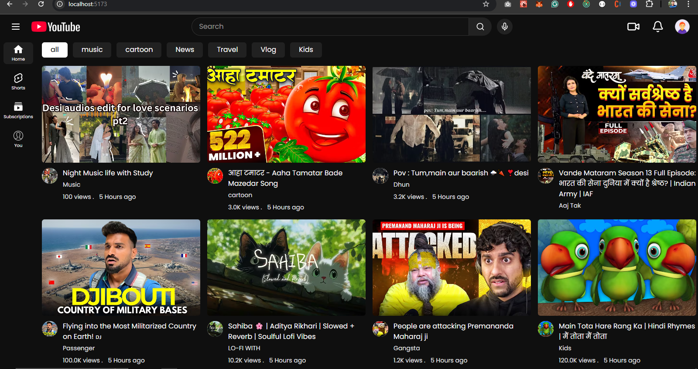
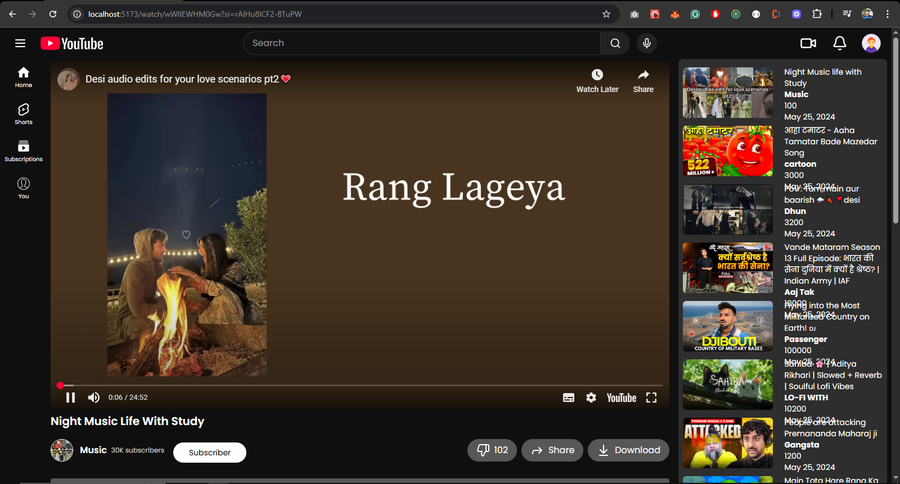
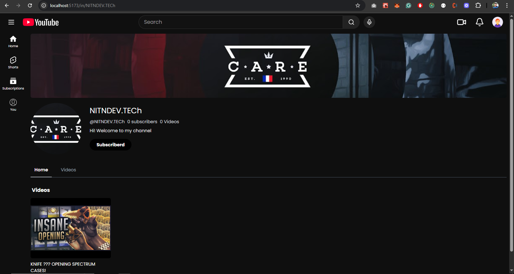

# 📺 YouTube Clone | MERN Stack Project (By Internshala)

## 📌 Objective

Build a full-stack YouTube clone where users can **view and interact with videos**.  
This project demonstrates how to create a real-world web application using the **MERN stack**:

- **MongoDB**
- **Express.js**
- **React.js**
- **Node.js**

---

## 🗂️ Folder Structure
# 📺 YouTube Clone | MERN Stack Project (By Internshala)

## 📌 Objective

Build a full-stack YouTube clone where users can **view and interact with videos**.  
This project demonstrates how to create a real-world web application using the **MERN stack**:

- **MongoDB**
- **Express.js**
- **React.js**
- **Node.js**

---

## 🗂️ Folder Structure

# 📺 YouTube Clone | MERN Stack Project (By Internshala)

## 📌 Objective

Build a full-stack YouTube clone where users can **view and interact with videos**.  
This project demonstrates how to create a real-world web application using the **MERN stack**:

- **MongoDB**
- **Express.js**
- **React.js**
- **Node.js**

---

## 🗂️ Folder Structure
/project-root
│
├── public/ # Static files (index.html, favicon, etc.)
├── src/
│ ├── assets/ # Images, icons, etc.
│ ├── components/ # Reusable UI components (VideoCard, Button, etc.)
│ ├── layout/ # Layout components like Navbar, Sidebar, Footer
│ ├── pages/ # Pages like Home, Login, Signup
│ ├── routes/ # Route configuration and protected routes
│ ├── style/ # CSS/SCSS files
│
└── README.md


---

## 🌐 Application Routes

| Route            | Description                           |
|------------------|---------------------------------------|
| `/`              | Home page of the application          |
| `/login`         | User login page                       |
| `/signin`        | User account registration page        |
| `/watch/:id`     | Watch video by video ID               |
| `/shorts`        | View short-form videos (Shorts)       |
| `/subscriptions` | View user's subscribed channels/videos|

---

## 🛠️ Tech Stack

- **Frontend**: HTML | CSS | JAVASCRIPT | REACT 
- **Backend**: Node.js, Express.js
- **Database**: MongoDB (Mongoose)
- **Routing**: React Router
- **State Management**: useState, useContext ,Redux 
- **API integration**: Axios | TanStack Query

---

## 🚀 Features

- User Authentication (Login/Signup)
- like and unlike
- Responsive design layout
- Dynamic routing
- comment add | delete | update | read
 

---

## 📦 Getting Started (Optional)

> If you'd like to add a setup section later:

```bash
# Clone the repo
git clone https://github.com/nitin01010/Frontend_YouTube.git

# Navigate to frontend and install dependencies
cd client
npm install

# Navigate to backend and install dependencies
cd ../server
npm install

# Run both frontend and backend
npm run dev


# video 
https://www.loom.com/share/9818a0d690a540db87d55ced80b4e26c?sid=858493c9-4af6-4f83-956b-7f6d5e08b026
https://www.loom.com/share/88c93a8c54764044b56383783961bf92?sid=a91d5216-c2b8-46e5-8d69-f9531fd0140d

;


